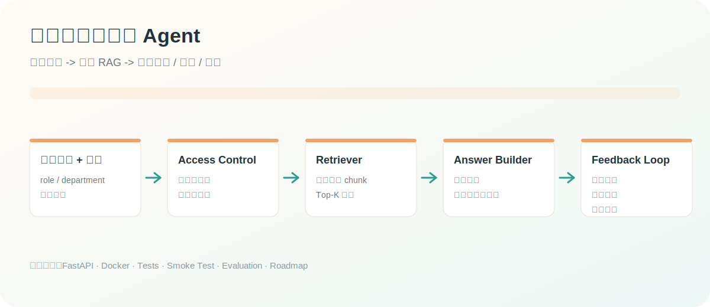
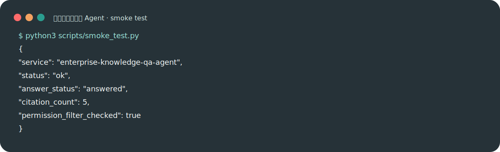

# 企业知识库问答 Agent

[](https://github.com/ranrango/enterprise-knowledge-qa-agent/actions/workflows/ci.yml)
[](https://www.python.org/)
[](https://fastapi.tiangolo.com/)
[](LICENSE)

面向企业内部知识库的 RAG 问答 Agent。系统支持文档检索、权限过滤、证据引用、拒答和反馈记录，适合展示企业级 Agent 项目中最常见的工程要求：**能问、能查、能引用、能拒答、能评估、能交付**。

## 视觉概览





## 项目亮点

| 能力 | 设计 |
|---|---|
| 企业知识库 RAG | 将制度、SOP、产品资料、工程文档切分成可检索 chunk |
| 权限过滤 | 按角色和部门过滤文档，避免越权回答 |
| 引用溯源 | 回答返回 citation，便于前端展示来源 |
| 拒答机制 | 证据不足或权限不足时明确拒答 |
| 反馈闭环 | `/feedback` 记录用户评价，供后续评测和优化 |

## 快速开始

```bash
cd 03_enterprise_knowledge_qa_agent
python3 -m src.app.cli --question "生产事故复盘报告应该包含哪些内容？" --role engineer --department engineering
```

启动 API：

```bash
python3 -m venv .venv
source .venv/bin/activate
pip install -e ".[dev]"
uvicorn src.app.main:app --reload --port 8030
```

## API 示例

```bash
curl -X POST http://127.0.0.1:8030/ask \
  -H "Content-Type: application/json" \
  -d '{"question":"生产事故复盘报告应该包含哪些内容？","role":"engineer","department":"engineering"}'
```

## 一键自检

```bash
python3 scripts/smoke_test.py
```

预期输出会包含：

```json
{
  "service": "enterprise-knowledge-qa-agent",
  "status": "ok",
  "answer_status": "answered",
  "citation_count": 5,
  "permission_filter_checked": true
}
```

更多请求样例见 [`examples/ask_request.json`](examples/ask_request.json)，回答检查点见 [`examples/expected_answer.md`](examples/expected_answer.md)。

## 项目结构

```text
03_enterprise_knowledge_qa_agent/
├── src/app/
│   ├── main.py          # FastAPI 入口
│   ├── cli.py           # CLI 演示入口
│   ├── agent.py         # 问答编排
│   ├── retriever.py     # 文档加载、权限过滤、检索
│   └── feedback.py      # 用户反馈记录
├── data/                # 样例企业知识库文档
├── examples/            # 请求样例和预期回答
├── scripts/             # smoke test 等工程脚本
├── storage/             # 运行时反馈文件，不提交真实数据
├── docs/                # 架构、API、部署、评估、路线图、面试稿
├── tests/
├── Dockerfile
├── docker-compose.yml
└── pyproject.toml
```

## 已知局限

- 当前默认使用轻量关键词检索，生产建议接入向量库、Reranker 和文档解析管线。
- 当前权限模型为样例字段，真实企业需要接入 SSO、部门组织架构和审计日志。
- 当前回答生成是模板化总结，真实项目可接入 LLM，但要保留引用和拒答规则。

## 评估与路线图

- [`docs/evaluation.md`](docs/evaluation.md)：定义检索命中、引用准确率、拒答准确率、越权拦截和反馈覆盖指标。
- [`docs/roadmap.md`](docs/roadmap.md)：说明如何升级到向量库、SSO/RBAC、企业文档源、审计日志和自动评测。
